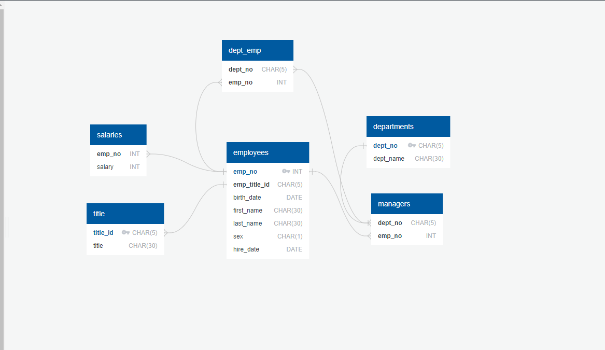

# sql-challenge
## Background:
#### The scenerio for this project is for a newly hired data engineer at Pewlett Hackard (a fictional company) is assigned the major task of completing a research project about people whom the company employeed during the 1980s and 1990s. All that remains of the employee database are six CSV files.  
   
To complete the project, design tables to hold the data and import the CSV files into a SQL database, and then answere questions about the data.
  
Skills: data modeling, data engineering, and data analysis.  
 

## Data Modeling
____
#### Inspect the CSV files and sketch a Entity Relationship diagram of the tables

  

## Data Engineering
____
#### Along with the ERD, table schema were created keeping in mind the specifications of data types, primary keys, foreign keys and other constraints. CSVs were imported into the corresponding SQL table.
  
## Data Analysis
____
Once the database was completed, the following queries were ran:
  
* List the following details of each employee: employee number, last name, first name, sex, and salary.

* List first name, last name, and hire date for employees who were hired in 1986.

* List the manager of each department with the following information: department number, department name, the manager's employee number, last name, first name.

* List the department of each employee with the following information: employee number, last name, first name, and department name.

* List first name, last name, and sex for employees whose first name is "Hercules" and last names begin with "B."

* List all employees in the Sales department, including their employee number, last name, first name, and department name.

* List all employees in the Sales and Development departments, including their employee number, last name, first name, and department name.

* In descending order, list the frequency count of employee last names, i.e., how many employees share each last name.